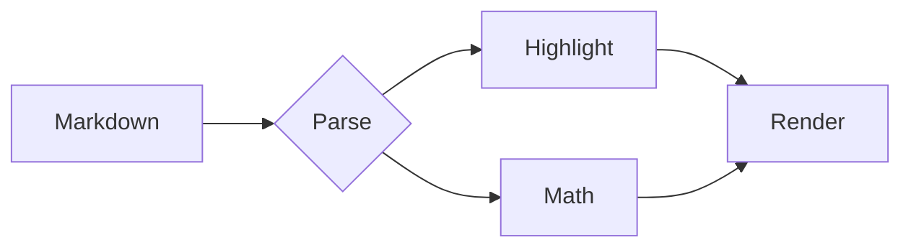

# Markdown Lens test fixture

A single document that exercises every renderer feature, so the smoke test has
something to assert against. :rocket:

## Text

Regular paragraph with **bold**, *italic*, ***both***, ~~strikethrough~~,
==highlighted==, ++inserted++, `inline code`, H~2~O, 10^3^, and a
[link to the site](https://baramsoft.com).

> A blockquote.
>
> With a second paragraph.

*[HTML]: HyperText Markup Language

The HTML abbreviation should get a tooltip.

Term
: Definition of the term.

Another term
: Its definition.

---

## Lists

1. First
2. Second
   1. Nested ordered
   2. Still nested
3. Third

- Bullet
- Another bullet
  - Nested bullet

- [x] Completed task
- [ ] Outstanding task

## Admonitions

::: note
A note admonition.
:::

::: warning
A warning admonition.
:::

::: danger
A danger admonition.
:::

## Table

| Language   | Extension | Highlighted |
| ---------- | --------- | ----------: |
| JavaScript | `.js`     |         yes |
| Python     | `.py`     |         yes |
| Rust       | `.rs`     |         yes |
| Swift      | `.swift`  |         yes |

## Code blocks

```javascript
const greet = (name = 'world') => `Hello, ${name}!`;

export default class Lens {
  #themes = new Map();

  constructor(themes) {
    for (const theme of themes) this.#themes.set(theme.id, theme);
  }

  resolve(id) {
    return this.#themes.get(id) ?? null;
  }
}
```

```python
from dataclasses import dataclass


@dataclass(slots=True)
class Theme:
    id: str
    name: str
    dark: bool = False

    def pair(self, other: "Theme") -> tuple["Theme", "Theme"]:
        return (self, other) if not self.dark else (other, self)
```

```rust
#[derive(Debug, Clone)]
pub struct Theme<'a> {
    pub id: &'a str,
    pub dark: bool,
}

impl<'a> Theme<'a> {
    pub fn companion(&self, others: &'a [Theme<'a>]) -> Option<&'a Theme<'a>> {
        others.iter().find(|t| t.dark != self.dark)
    }
}
```

```swift
struct Theme: Identifiable, Hashable {
    let id: String
    let name: String
    var isDark: Bool = false
}

let themes = [Theme(id: "nord", name: "Nord", isDark: true)]
print(themes.filter(\.isDark).map(\.name).joined(separator: ", "))
```

```bash
#!/usr/bin/env bash
set -euo pipefail

for theme in "$@"; do
  printf 'building %s\n' "${theme}"
done
```

```sql
SELECT t.id, t.name, COUNT(u.id) AS installs
FROM themes AS t
LEFT JOIN usage AS u ON u.theme_id = t.id
GROUP BY t.id, t.name
HAVING COUNT(u.id) > 10
ORDER BY installs DESC;
```

```diff
- const theme = 'github';
+ const theme = 'github-dark';
```

```
A fence with no language at all.
```

## Math

Inline math: $e^{i\pi} + 1 = 0$ and $\sum_{k=1}^{n} k = \frac{n(n+1)}{2}$.

Display math:

$$
\int_{-\infty}^{\infty} e^{-x^2}\,dx = \sqrt{\pi}
$$

## Diagram



## Footnotes

Markdown Lens renders footnotes[^1] and multiple references[^2].

[^1]: The first footnote.
[^2]: The second footnote, with `code` inside.

## Images and details

<details>
<summary>A collapsed section</summary>

Hidden content with a nested list:

- one
- two

</details>
